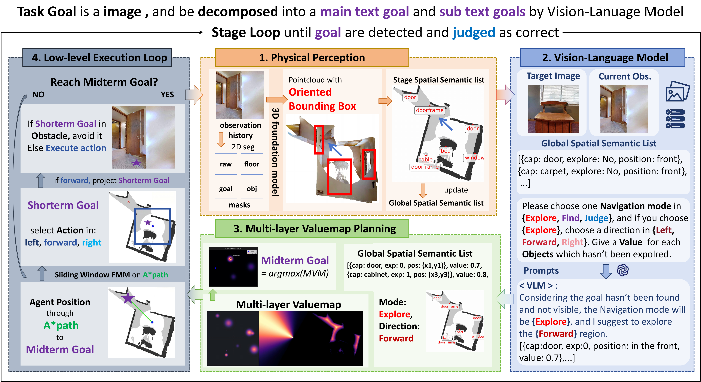

# MVP-Nav

**MVP-Nav: Multi-layer Value Map Planner Navigator** is a physical-aware, RGB-only framework for zero-shot Object Goal Navigation (ZSON). The paper has been accepted to **RSS 2026**.

MVP-Nav reconstructs explicit physical occupancy from monocular RGB observations, lifts 2D semantic instances into 3D oriented bounding boxes, and plans through a Multi-layer Value Map (MVM) that combines semantic priorities, exploration guidance, and traversability constraints.



## Method

The implementation follows the paper pipeline:

1. **Physical Perception**: RGB observations are processed by VGGT and Grounded-SAM to build point clouds, oriented bounding boxes, BEV maps, and a Global Spatial Semantic List (GSSL).
2. **VLM Reasoning**: the goal and GSSL are scored by a VLM/LLM module to choose the navigation mode and semantic priorities.
3. **MVM Planning**: semantic, direction, exploration, and safety fields are fused into a shared cost space to select a midterm goal.
4. **Low-level Execution**: A* and FMM generate short-term goals, with semantic floor re-projection used as a safety check.

Core mapping:

| Paper component | Code |
| --- | --- |
| Physical Perception | `src/core/physical_perception.py`, `src/map/spacev6.py` |
| VLM Reasoning | `src/core/vlm_reasoning.py`, `src/graph/graphv2.py` |
| MVM Planning | `src/core/mvm_planning.py`, `src/graph/graphv2.py` |
| Low-level Execution | `src/core/low_level_execution.py`, `src/agent/unigoal/agent.py` |
| Episode loop | `src/core/navigation.py`, `src/pipeline/navigation_loop.py` |
| Main entry | `main_nav.py` |

## Repository Layout

```text
.
├── main_nav.py                         # Main Habitat navigation entry
├── configs/                            # Runtime config
├── scripts/download_nav_datasets.py    # Episode dataset downloader
├── src/
│   ├── agent/                          # Agent control and perception wrapper
│   ├── core/                           # Paper-aligned navigation modules
│   ├── data/                           # Dataset path and validation helpers
│   ├── envs/                           # Habitat and real-world env adapters
│   ├── graph/                          # GSSL, VLM reasoning, MVM
│   ├── map/                            # VGGT, point cloud, BEV and OBB logic
│   └── pipeline/                       # run_episode wrapper
└── docs/assets/                        # README figures
```

Large datasets, checkpoints, logs, and paper source materials are intentionally ignored by git.

## Environment

Use the project from the repository root:

```bash
cd /mnt/pool1/sharehome/xiewenyuan/vlm/zson
```

The runtime expects a Habitat-capable Python environment with at least:

```text
torch
habitat-lab
habitat-sim
hydra-core
omegaconf
gym
numpy-quaternion
opencv-python
scikit-image
matplotlib
supervision
transformers
```

Local third-party source folders are automatically added to `PYTHONPATH` by `main_nav.py` when present:

```text
third_party/habitat-lab
LightGlue-main
third_party/Grounded-Segment-Anything
```

Model checkpoints should be placed locally and are not committed:

```text
data/models/groundingdino_swint_ogc.pth
data/models/sam_vit_h_4b8939.pth
data/models/model.pt
```

The current code also expects a local BERT tokenizer/model path:

```text
/mnt/pool1/sharehome/xiewenyuan/vlm/object_nav/bert-base-uncased
```

## Datasets

Episode datasets are stored in shared storage:

```text
/mnt/pool1/sharehome/xiewenyuan/sharedata/datasets
```

Download Habitat ObjectNav episode files:

```bash
python scripts/download_nav_datasets.py --dataset objectnav_hm3d
python scripts/download_nav_datasets.py --dataset objectnav_mp3d
```

Expected episode layout:

```text
/mnt/pool1/sharehome/xiewenyuan/sharedata/datasets/objectnav/hm3d/v2/{train,val,val_mini}
/mnt/pool1/sharehome/xiewenyuan/sharedata/datasets/objectnav/mp3d/v1/{train,val,val_mini}
```

Scene assets are not downloaded by this script because HM3D/MP3D meshes require separate access/licensing. Put or symlink scenes under:

```text
data/scene_datasets/hm3d_v0.2
data/scene_datasets/mp3d
```

InstanceImageNav data, when used, follows:

```text
data/datasets/instance_imagenav/hm3d/v3/{train,val,val_mini}
```

## Quick Checks

Validate Python syntax and dataset paths:

```bash
python -m py_compile main_nav.py src/data/nav_datasets.py scripts/download_nav_datasets.py
python main_nav.py --nav-dataset objectnav_hm3d --split val_mini --num-episodes 1 --smoke-env-only
python main_nav.py --nav-dataset objectnav_mp3d --split val_mini --num-episodes 1 --smoke-env-only
```

`--smoke-env-only` constructs Habitat and resets one episode without loading the heavy MVP-Nav perception models.

## Running

Run ObjectNav on HM3D:

```bash
python main_nav.py \
  --nav-dataset objectnav_hm3d \
  --split val_mini \
  --num-episodes 1
```

Run ObjectNav on MP3D:

```bash
python main_nav.py \
  --nav-dataset objectnav_mp3d \
  --split val_mini \
  --num-episodes 1
```

Run the original InstanceImageNav/HM3D path:

```bash
python main_nav.py \
  --nav-dataset instance_imagenav_hm3d \
  --split val_mini \
  --num-episodes 1
```

Useful flags:

```text
--device-id 1
--data-root /mnt/pool1/sharehome/xiewenyuan/sharedata
--scene-data-root data/scene_datasets
--skip-dataset-check
--smoke-env-only
```

Outputs are written to:

```text
vis_log_nav/<timestamp>/
vis_log_nav_good/<timestamp>/
result_nav.txt
outputs/
```

These paths are ignored by git.

## Notes

- `mvp_nav/` contains local RSS 2026 paper tex, figures, and materials. It is intentionally ignored and should not be pushed.
- `data/` and shared dataset/model paths are local runtime assets, not repository content.
- API keys and service endpoints should be kept out of committed configs when preparing public releases.
